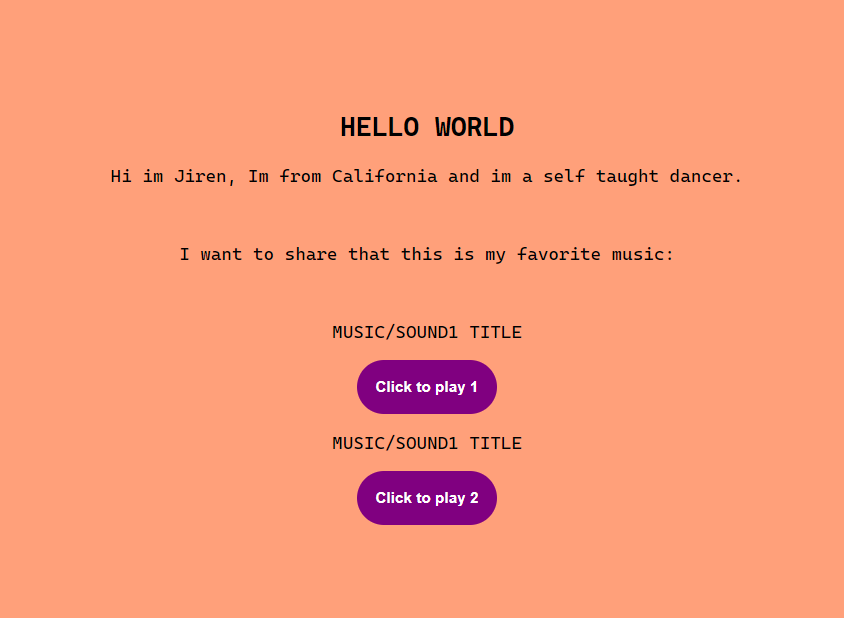

# Javascriptplaypausebuttonforsound

https://www.youtube.com/watch?v=8DcVPPkpBjY
PLEASE DOWNLOAD THE SITE! Read This till the end

In this tutorial you gonna be making a button that can play/pause a music/sounds of what you want to link in <audio> tag
its just a simple tutorial nothing pro

_update_
this site have no music you have to update the html audio file to see the functionality for your self
Read - PLEASEREADTHIS.TXT File for more information

=======
  
 *update*
           
  this site have no music you have to provide one/more and update the html audio file to see the functionality of the button
  PLEASE READ!!! - READBEFOREDOWNLOADING.TXT File for more information.
  
  

heres the website:

